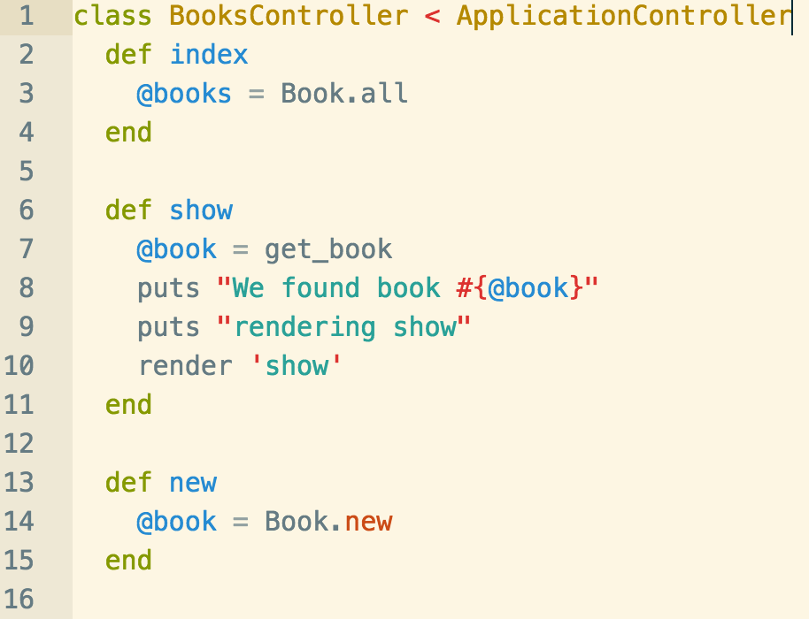

Assuming the following code:

**How could we use pry to set a breakpoint and start debugging on line 8?**

1. pry -8
2. add `debug` at line 8
3. within a debugger session in this controller run `break 8`
4. add `binding.pry` at line 8
