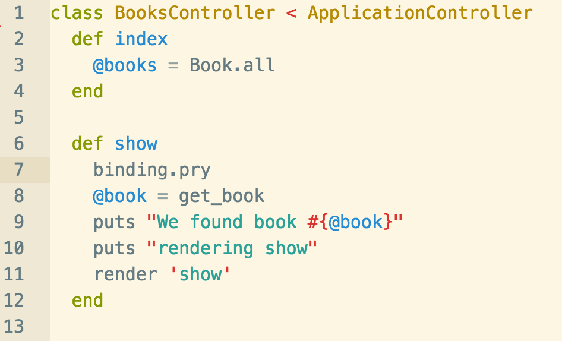

Assuming the following code,

And assuming that we've stopped at line 8 right after `binding.pry`,

**Which command would I use if I don't want to go-deeper and just want to stop again after line 8 is complete?**
(That is I want to stop at line 9 and not set a breakpoint.)

1. `ls`
2. `continue`
3. `step`
4. `next`

Solution:

1. `ls`
2. `continue`
3. `step`
4. **`next`**

The answer is **4. next**
If you said `step` you're close.  `step` however would actually take us to the first-line in the get_book method.
`continue` would take us out of the debugger until another breakpoint is hit.
